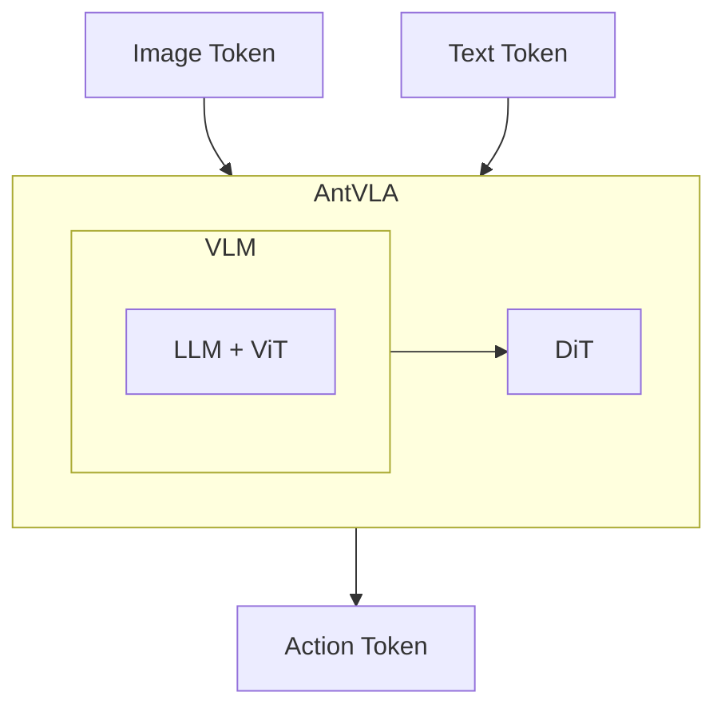

# AntVLA
VLA designed to navigate Mobile Robots

## Navigation with VLA

The idea is to implement the VLA which can understand the environment and make decisions to navigate the robot.

## Architecture

